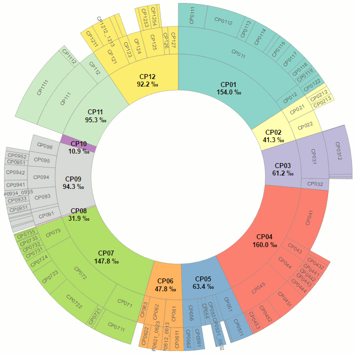

# d3.sunburst

[d3.sunburst](http://jgaffuri.github.io/d3.sunburst/) is a library to easily create sunburst charts such as this one:

[](http://jgaffuri.github.io/EurostatVisu/coicop_sunburst.html)

## Quick start

An example: [example_v3.html](http://jgaffuri.github.io/d3.sunburst/example_v3.html).

First, add the element where the chart should bloom:

```html
<div id="sunburst"></div>
```

The data structure is defined like that:

```javascript
//build codes hierarchy
var codesHierarchy = {code:"Total",children:[
    {code:"Part1",children:[{code:"1_1"},{code:"1_2"},{code:"1_3"},{code:"1_4"}]},
    {code:"Part2",children:[
        {code:"2_1",children:[{code:"2_1_1"},{code:"2_1_2"},{code:"2_1_3"},]},
        {code:"2_2"}
    ]},
    {code:"Part3",children:[{code:"3_1"}]},
    {code:"Part4"}
]};
```

Values are then defined for some codes:

```javascript
//first set of values
var values = {
    "1_1":12.4, "1_2":2.4, "1_3":5.8, "1_4":9.2, "2_1_1":2.0, "2_1_2":6.0, "2_1_3":10, "2_2":5.4, "3_1":15.8, "Part4":32.3
};
```

Finally, the chart is built with:

```javascript
//build sunburst with first set of values
var sb = d3.sunburst()
    .codesHierarchy(codesHierarchy)
    .set(values);
```

The chart can simply be updated with another set of values:

```javascript
var newValues = {"1_1":1.7, ...};
sb.set(newValues);
```

See the code example here: https://github.com/jgaffuri/d3.sunburst/blob/gh-pages/example_v3.html

## Documentation

| Method | Returns | Description |
| --- | --- | --- |
| codesHierarchy(Object codeHierarchy) | this or Object | TODO |
| set(Object values, Number transitionDuration) | this | Update the chart with new values. The values should be specified as a dictionnary {code1;value1, code2;value2, ...}. The transition duration is in milliseconds. It is set to 0 by default. |
| drawLabels(Number transitionDuration) | this | TODO |
| eraseLabels(Number transitionDuration) | this | TODO |
| codesHierarchy(Object v) | this or Object | TODO |
| div(String v) | this or String | TODO |
| radius(Number v) | this or Number | TODO |
| strokeWidth(Number v) | this or Number | TODO |
| strokeColor(String v) | this or String | TODO |
| codeToColor(Function v) | this or Function | TODO |
| setmouseover(Function v) | this or Function | TODO |
| setmouseout(Function v) | this or Function | TODO |
| codeToLabelText(Function v) | this or Function | TODO |
| fontFamily(Function v) | this or Function | TODO |
| fontSize(Function v) | this or Function | TODO |
| fontFill(Function v) | this or Function | TODO |
| fontWeight(Function v) | this or Function | TODO |
| fontOrientation(Function v) | this or Function | TODO |
| labelRotationParameter(Function v) | this or Function | TODO |
| labelRemovalParameter(Function v) | this or Function | TODO |

## About

[d3.sunburst](http://jgaffuri.github.io/d3.sunburst/) is designed as an add-on of [D3 library](https://d3js.org/) inspired from the numerous existing sunburst examples such as [this one](https://bl.ocks.org/mbostock/4348373). It follows the same approach as [C3js](http://c3js.org/).
